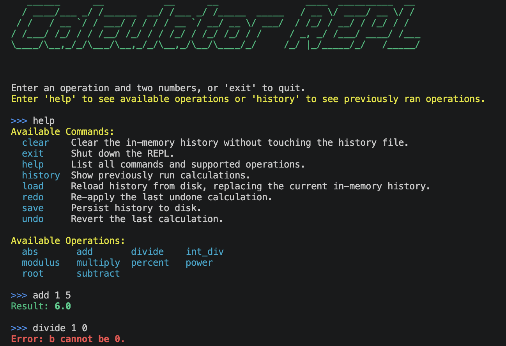

# Module 6 - Midterm Project

A command-line calculator REPL built in Python. Started as a plain add/subtract/multiply/divide loop and has grown, module by module, into a small pattern showcase: a **Factory** for calculations, a **Singleton** for configuration, a **Memento** for undo/redo, an **Observer** for logging and auto-save, and now a **Command** pattern for the REPL's own dispatch loop.

## What Changed in Module 6

- Replaced the REPL's growing `if`/`elif` chain with a **Command pattern**: every REPL action (`history`, `save`, `undo`, an arithmetic operation, ...) is now a `ReplCmd` object with its own `execute()`, looked up through `ReplCmdFactory` by name — same registration style as `CalculationFactory`
- Added `app/repl_commands.py`: `ReplCmd` (ABC), `ReplCmdFactory`, and one class per command (`HistoryCmd`, `SaveCmd`, `ClearCmd`, `LoadCmd`, `UndoCmd`, `RedoCmd`, `HelpCmd`, `ExitCmd`), plus `CalculateCmd` as the fallback for arithmetic input
- Added `app/exceptions.py` with `ReplExit`, a control-flow signal `ExitCmd` raises so the REPL loop can break cleanly instead of special-casing `exit` in the dispatch logic
- `help` now renders a column-aligned, colorized table of commands (with descriptions) and a grid of supported operations, generated live from the registries instead of a hardcoded string
- `CALCULATOR_PRECISION` and `CALCULATOR_MAX_INPUT_VALUE` are now actually enforced: results are rounded to the configured precision in `Calculator.calculate()`, and operands exceeding the max value raise a `ValueError` before a calculation runs
- Added four new operations: `percent`, `abs` (absolute difference), `int_div` (integer division), and `root` (nth root)
- Added `test_repl_commands.py`; test suite and coverage tooling now sit at 100% line and branch coverage across `app/`

## Project Structure

```
mod6_assignment/
├── .github/
│   └── workflows/
│       └── tests.yml
├── app/
│   ├── __init__.py
│   ├── calculation.py       # Calculation ABC, CalculationFactory, operation subclasses
│   ├── calculator.py        # Calculator: history, undo/redo, precision/max-value enforcement
│   ├── calculator_config.py # Singleton config loaded from environment variables
│   ├── exceptions.py        # ReplExit, raised to unwind the REPL loop on 'exit'
│   ├── memento.py           # CalculatorMemento for undo/redo snapshots
│   ├── observer.py          # Subscriber base class, CalculationSubscriber, AutoSaveSubscriber
│   ├── operations.py        # Static arithmetic operations
│   ├── repl.py              # REPL loop: reads input, dispatches to a ReplCmd
│   └── repl_commands.py     # ReplCmd, ReplCmdFactory, and all concrete commands
├── tests/
│   ├── test_calculation.py
│   ├── test_calculator.py
│   ├── test_calculator_config.py
│   ├── test_memento.py
│   ├── test_observer.py
│   ├── test_operations.py
│   ├── test_repl.py
│   └── test_repl_commands.py
├── main.py
├── .env
├── .coveragerc
├── .gitignore
├── requirements.txt
├── LICENSE
└── README.md
```

## Setup

```bash
python3 -m venv .venv
source .venv/bin/activate
pip install -r requirements.txt
```

## Configuration

Settings are read from environment variables at startup, via `CalculatorConfig` (a singleton — see [Design Patterns](#design-patterns) below). `.env` is git-ignored, so it's not checked into this repo; create your own at the project root using the example below.

### Available Configuration

| Variable                            | Default          | Description                                                 |
|--------------------------------------|------------------|----------------------------------------------------------------|
| `CALCULATOR_BASE_DIR`                | project root     | Base directory that `LOG_DIR`/`HIST_DIR` default under          |
| `CALCULATOR_MAX_HISTORY_SIZE`        | `100`            | Maximum number of calculations kept in memory                   |
| `CALCULATOR_AUTO_SAVE`               | `true`           | Whether auto-save is enabled at all                              |
| `CALCULATOR_EVENTS_BEFORE_AUTOSAVE`  | `1`              | Number of calculations before an auto-save is triggered           |
| `CALCULATOR_PRECISION`               | `5`              | Decimal places results are rounded to                             |
| `CALCULATOR_MAX_INPUT_VALUE`         | `1000`           | Operands above this value are rejected with a `ValueError`        |
| `CALCULATOR_DEFAULT_ENCODING`        | `utf-8`          | File encoding for history and log files                           |
| `CALCULATOR_LOG_DIR`                 | `<base>/logs`    | Directory the log file is written to                              |
| `CALCULATOR_HIST_DIR`                | `<base>/history` | Directory the history CSV is written to                           |
| `CALCULATOR_LOG_FILE`                | `<log dir>/calculator.log` | Full path to the log file                               |
| `CALCULATOR_HISTORY_FILE`            | `<hist dir>/history.csv`   | Full path to the history CSV file                       |

### Example `.env`

```
CALCULATOR_BASE_DIR='.'
CALCULATOR_MAX_HISTORY_SIZE='50'
CALCULATOR_AUTO_SAVE='true'
CALCULATOR_EVENTS_BEFORE_AUTOSAVE='5'
CALCULATOR_PRECISION='3'
CALCULATOR_MAX_INPUT_VALUE='100'
CALCULATOR_DEFAULT_ENCODING='utf-8'
# Optional overrides — omit to use the CALCULATOR_BASE_DIR-relative defaults above
# CALCULATOR_LOG_DIR='./logs'
# CALCULATOR_HIST_DIR='./history'
# CALCULATOR_LOG_FILE='./logs/calculator.log'
# CALCULATOR_HISTORY_FILE='./history/history.csv'
```

## Usage

```bash
python main.py
```

```
Calculator REPL

Enter an operation and two numbers, or 'exit' to quit.
Enter 'help' to see available operations or 'history' to see previously ran operations.
>>> add 5 3
Result: 8.0
>>> percent 1 4
Result: 25.0
>>> root 27 3
Result: 3.0
>>> history
1. Addition(a = 5.0, b = 3.0, result = 8.0)
2. Percent(a = 1.0, b = 4.0, result = 25.0)
3. Root(a = 27.0, b = 3.0, result = 3.0)
>>> undo
History has been undone.
>>> save
History saved to disk.
>>> help
Available Commands:
  clear    Clear the in-memory history without touching the history file.
  exit     Shut down the REPL.
  help     List all commands and supported operations.
  history  Show previously run calculations.
  load     Reload history from disk, replacing the current in-memory history.
  redo     Re-apply the last undone calculation.
  save     Persist history to disk.
  undo     Revert the last calculation.

Available Operations:
  abs      add      divide   int_div
  modulus  multiply percent  power
  root     subtract
>>> exit
Exiting calculator... Goodbye ~
```

### Screenshot

The REPL colors success, error, and info output differently (green/red/yellow/cyan via `colorama`), which doesn't come through in the plain-text transcript above.



## Commands

| Command              | Description                                          |
|-----------------------|------------------------------------------------------|
| `<op> <a> <b>`       | Perform a calculation, e.g. `add 5 3`                |
| `history`            | Display all calculations in the current session      |
| `undo`               | Revert the last calculation                          |
| `redo`               | Re-apply the last undone calculation                  |
| `save`               | Persist the current history to disk                   |
| `load`               | Reload history from disk, replacing in-memory state   |
| `clear`              | Clear in-memory history without touching the file     |
| `help`               | List all commands and supported operations            |
| `exit`               | Shut down the REPL                                    |

## Supported Operations

| Operation  | Example         | Notes                                  |
|------------|-----------------|-----------------------------------------|
| `add`      | `add 5 3`       |                                           |
| `subtract` | `subtract 10 4` |                                           |
| `multiply` | `multiply 3 4`  |                                           |
| `divide`   | `divide 10 2`   | Raises on division by zero               |
| `power`    | `power 2 8`     |                                           |
| `modulus`  | `modulus 10 3`  | Raises on division by zero               |
| `percent`  | `percent 1 4`   | Expresses a as a percentage of b         |
| `abs`      | `abs 3 9`       | Absolute difference between a and b      |
| `int_div`  | `int_div 10 3`  | Floored (integer) division               |
| `root`     | `root 27 3`     | The b-th root of a                       |

## Design Patterns

| Pattern   | Where                                                        | What it's for                                             |
|-----------|----------------------------------------------------------------|-------------------------------------------------------------|
| Factory   | `CalculationFactory` (`calculation.py`), `ReplCmdFactory` (`repl_commands.py`) | Register and build subclasses by name              |
| Singleton | `CalculatorConfig` in `calculator_config.py`                  | One shared config instance read from environment variables   |
| Memento   | `CalculatorMemento` in `memento.py`                           | Snapshot/restore history for undo and redo                   |
| Observer  | `Subscriber` and subclasses in `observer.py`                  | React to calculations (logging, auto-save) without coupling to `Calculator` |
| Command   | `ReplCmd` and subclasses in `repl_commands.py`                | Encapsulate each REPL action as an object the loop can dispatch to |
| Decorator | `@register_command` (`repl_commands.py`), `@register_calculation` (`calculation.py`) | Register a command/operation onto its factory at class-definition time, so `help` can list whatever's currently registered without hardcoding it |

`help`'s command table and operation grid are built by reading `ReplCmdFactory.get_supported_cmds()` and `Calculator.get_supported_operations()` at call time ([repl_commands.py](app/repl_commands.py)) — both populated purely by which classes carry a `@register_command`/`@register_calculation` decorator. Add a new command or operation and decorate it, and it shows up in `help` with no change to `HelpCmd` itself.

## Running Tests

```bash
pytest --cov=app --cov-report=term-missing --cov-fail-under=100
```
